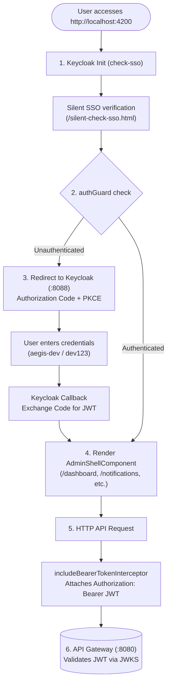

# Aegis Admin Frontend

Administrative web dashboard for the AegisNotify notification orchestration platform.

## Table of Contents

- [Purpose](#purpose)
- [Tech Stack](#tech-stack)
- [Getting Started](#getting-started)
  - [Prerequisites](#prerequisites)
  - [Installation](#installation)
  - [Available Scripts](#available-scripts)
  - [Development Server](#development-server)
  - [Build](#build)
  - [Testing](#testing)
- [Keycloak & Security Configuration](#keycloak--security-configuration)
  - [Client Setup](#client-setup)
  - [Required Scopes](#required-scopes)
  - [Default Test Credentials](#default-test-credentials)
- [Environment Configuration](#environment-configuration)
- [Authentication & Routing Flow](#authentication--routing-flow)
- [Application Features & Routes](#application-features--routes)
- [Theme System](#theme-system)
- [Project Structure](#project-structure)
- [Architectural Decisions](#architectural-decisions)
- [Changelog](#changelog)

---

## Purpose

`aegis-admin-frontend` serves as the centralized management and monitoring interface for AegisNotify. It enables operators to:
- Monitor notification dispatch lifecycles, statuses, and delivery attempts in real time.
- Inspect notification details, message payloads, and audit traces.
- Track provider health, primary/secondary failover conditions, and circuit breaker states.
- Review delivery performance metrics, throughput, latency, and failure analytics.
- Manage system operational settings and theme preferences.

## Tech Stack

- **Framework**: Angular 22 (Standalone Components, Signals, Control Flow syntax `@if`/`@for`)
- **Styling**: SCSS (CSS Custom Properties Design Tokens, Light/Dark theme support, 8px grid spacing)
- **Package Manager**: pnpm (`pnpm@11.22.0`)
- **Authentication**: Keycloak / OIDC (`keycloak-angular` 22 & `keycloak-js` 26) with Authorization Code Flow + PKCE
- **HTTP & Interceptors**: Angular HttpClient with `includeBearerTokenInterceptor` for Bearer JWT injection
- **Testing**: Vitest & JSDOM (`@angular/build`, `vitest`)
- **Tooling**: TypeScript 6, Angular CLI 22, Prettier

## Getting Started

### Prerequisites

Ensure the following tools and backend dependencies are installed and running:
- **Node.js**: `v20+` (LTS recommended)
- **pnpm**: `pnpm@11.x` (`npm install -g pnpm`)
- **Keycloak Identity Provider**: Running locally on `http://localhost:8088` (realm `aegis`)
- **Aegis API Gateway**: Running on `http://localhost:8080`

### Installation

Install project dependencies using pnpm:

```bash
pnpm install
```

### Available Scripts

The following scripts are defined in `package.json`:

| Command | Script | Description |
| --- | --- | --- |
| `pnpm start` | `ng serve` | Runs the development server on `http://localhost:4200/` |
| `pnpm build` | `ng build` | Compiles the production bundle into `dist/aegis-admin-frontend` |
| `pnpm watch` | `ng build --watch --configuration development` | Builds and watches for file changes |
| `pnpm test` | `ng test` | Executes unit tests using Vitest |
| `pnpm ng` | `ng` | Invokes the Angular CLI |

### Development Server

Start the local development server:

```bash
pnpm start
# or
ng serve
```

Navigate to `http://localhost:4200/`. The application will automatically reload if you change any source files.

### Build

Compile the application for production:

```bash
pnpm build
# or
ng build
```

The build artifacts will be stored in the `dist/aegis-admin-frontend` directory.

### Testing

Run unit tests via Vitest:

```bash
pnpm test
# or
ng test
```

## Keycloak & Security Configuration

The frontend authenticates users via OpenID Connect against a Keycloak instance.

### Client Setup

Configure the public client in Keycloak:

- **Realm**: `aegis`
- **Client ID**: `aegis-admin-frontend`
- **Client Type**: `OpenID Connect`
- **Client Authentication**: `Off` (Public client)
- **Authentication Flow**: Standard Flow (Authorization Code Flow) with PKCE (`S256`)
- **Valid Redirect URIs**: `http://localhost:4200/*`
- **Valid Post Logout Redirect URIs**: `http://localhost:4200/*`
- **Web Origins**: `http://localhost:4200`

### Required Scopes

The client utilizes the following default realm client scopes:
- `notification:read`: Consult notifications, dispatch status, and logs.
- `notification:write`: Send and re-dispatch notifications.
- `audit:read`: Consult audit trails and lifecycle events.

> **Note**: These scopes are assigned as default client scopes in Keycloak. Requesting custom scopes explicitly in the `provideKeycloak` init options is omitted to prevent silent SSO loop mismatches.

### Default Test Credentials

For local development with the default imported realm (`docker/keycloak/aegis-realm.json`):
- **Username**: `aegis-dev`
- **Password**: `dev123`

## Environment Configuration

Configuration files are located in `src/environments/` and the project root:

| File | Environment | Description |
| --- | --- | --- |
| `src/environments/environment.ts` | Production / Default | Base API Gateway and Keycloak endpoint configuration |
| `src/environments/environment.development.ts` | Development | Development overrides and local mappings |
| `.env` / `.env.development` | Local Tooling | Environment variable declarations for CLI / Docker |

### Configuration Parameters

| Parameter | Environment Variable | Default Value | Description |
| --- | --- | --- | --- |
| `apiBaseUrl` | `API_BASE_URL` | `http://localhost:8080` | Aegis API Gateway base URL |
| `keycloakUrl` | `KEYCLOAK_URL` | `http://localhost:8088` | Keycloak Identity Provider URL |
| `keycloakRealm` | `KEYCLOAK_REALM` | `aegis` | Keycloak Realm name |
| `keycloakClientId` | `KEYCLOAK_CLIENT_ID` | `aegis-admin-frontend` | OIDC Public Client ID |

## Authentication & Routing Flow

The frontend implements an OpenID Connect (OIDC) flow managed by `keycloak-angular` and Angular Router:



1. **Keycloak Initialization (`provideKeycloak`)**: On application startup, Keycloak initializes with `onLoad: 'check-sso'`, performing a silent session check via `/silent-check-sso.html`.
2. **Route Protection (`authGuard`)**: The functional `authGuard` verifies whether an active session exists before activating `AdminShellComponent` and its child routes.
3. **Login Redirect & PKCE**: If unauthenticated, the user is redirected to the Keycloak login page (`http://localhost:8088`) using the Authorization Code Flow with PKCE (`S256`).
4. **Callback & Token Exchange**: Upon successful login, Keycloak redirects back to the application where the authorization code is exchanged for JWT access and refresh tokens.
5. **AdminShell Rendering**: The authenticated user accesses `AdminShellComponent` and protected feature routes (`/dashboard`, `/notifications`, `/providers`, etc.).
6. **Bearer Token Interception**: All outgoing HTTP requests matching `http://localhost:8080/api/**` automatically receive the `Authorization: Bearer <access_token>` header via `includeBearerTokenInterceptor`.
7. **Token Lifecycle & Refresh**: `withAutoRefreshToken` seamlessly refreshes expiring tokens in the background through `AutoRefreshTokenService`.

## Application Features & Routes

The routing structure defined in `app.routes.ts` is organized hierarchically under `AdminShellComponent`:

| Route | Component | Description |
| --- | --- | --- |
| `/` | Redirect | Automatically redirects to `/dashboard` |
| `/dashboard` | `DashboardPage` | Overview of system metrics, dispatch statistics, and system health |
| `/notifications` | `NotificationsPage` | Notification management, filtering, status tracking, and dispatch actions |
| `/notifications/:id` | `NotificationDetailPage` | Detailed inspection of single notification payloads, logs, and provider statuses |
| `/providers` | `ProvidersPage` | Provider health tracking, primary/secondary statuses, and circuit breakers |
| `/metrics` | `MetricsPage` | Performance dashboards, latency trends, and throughput statistics |
| `/settings` | `SettingsPage` | Administrative preferences, environment information, and system parameters |
| `**` | Redirect | Wildcard fallback redirecting unknown routes to `/dashboard` |

## Theme System

The application features a built-in Light and Dark theme system:

- **Default Theme**: Light Theme.
- **Theme Switcher**: Located in the topbar directly to the right of the user profile.
- **State Management**: Managed by `ThemeService` using Angular Signals (`isDarkTheme`).
- **Persistence**: User theme choice is persisted in `localStorage` under `aegis-theme`.
- **SCSS Architecture**: Variables defined on `:root` represent the default light palette, while `[data-theme="dark"]` provides the dark mode overrides.

## Project Structure

```text
aegis-admin-frontend/
├── public/
│   ├── favicon.ico
│   └── silent-check-sso.html        # Keycloak silent SSO check callback
├── src/
│   ├── app/
│   │   ├── core/
│   │   │   ├── auth/
│   │   │   │   ├── auth.guard.ts     # Functional OIDC route guard
│   │   │   │   └── auth.service.ts   # User profile & auth helper service
│   │   │   └── theme/
│   │   │       └── theme.service.ts  # Signal-based Light/Dark theme service
│   │   ├── features/
│   │   │   ├── dashboard/pages/      # Dashboard page component
│   │   │   ├── metrics/pages/        # Delivery & Prometheus metrics page
│   │   │   ├── notifications/pages/  # Notification list & detail pages
│   │   │   ├── providers/pages/      # Provider status & circuit breakers page
│   │   │   └── settings/pages/       # System configuration page
│   │   ├── layouts/
│   │   │   ├── admin-shell/          # Main application shell with router-outlet
│   │   │   ├── sidebar/              # Navigation sidebar with active link indicator
│   │   │   └── topbar/               # Header with title, env badge, services, user & theme toggle
│   │   ├── app.config.ts             # Application providers (Keycloak, HttpClient, Router)
│   │   ├── app.routes.ts             # Feature routes with lazy loading and auth guard
│   │   ├── app.html                  # Root template (<router-outlet />)
│   │   ├── app.scss                  # Root component styles
│   │   └── app.ts                    # Root component definition
│   ├── environments/
│   │   ├── environment.ts            # Base / Production environment config
│   │   └── environment.development.ts# Development environment config
│   ├── index.html                    # Single Page Application HTML entrypoint
│   ├── main.ts                       # Application bootstrap
│   └── styles.scss                   # Global design tokens, resets, and theme definitions
├── .env                              # Environment variables for tooling
├── .env.development                  # Dev environment variables
├── angular.json                      # Angular CLI configuration
├── package.json                      # Project dependencies and scripts
├── pnpm-lock.yaml                    # Deterministic lockfile
└── tsconfig.json                     # TypeScript compiler configuration
```

## Architectural Decisions

1. **Standalone Components**: All components utilize Angular standalone architecture, simplifying dependency graphs and module boundaries.
2. **Lazy Loading by Feature**: Feature pages are lazily loaded using dynamic imports (`loadComponent: () => import(...)`) to minimize initial bundle size.
3. **Hexagonal Backend Alignment**: Frontend features align directly with backend domain services (`notifications`, `providers`, `metrics`, `audit`).
4. **Clean SCSS Design Tokens**: Consistent 8px spacing scale, semantic color variables, and zero duplicated styles across components.
5. **Standardized OIDC & PKCE**: Industry-standard PKCE authentication without client secrets in the browser, verified with Bearer token injection on the gateway proxy.

## Changelog

### [Unreleased]
- Added complete project documentation with architecture, OIDC authentication flow, and feature details.
- Implemented `ThemeService` supporting Light (default) and Dark themes with topbar toggle and localStorage persistence.
- Implemented `AuthService` and functional `authGuard` protecting all administrative routes under `AdminShellComponent`.
- Configured `keycloak-angular` with `onLoad: 'check-sso'`, `withAutoRefreshToken`, and `includeBearerTokenInterceptor` for `http://localhost:8080/api/*`.
- Consolidated and cleaned up SCSS styles, removing redundant rules and unifying CSS custom properties across components.
- Scaffolded lazy-loaded feature pages for `dashboard`, `notifications`, `notification-detail`, `providers`, `metrics`, and `settings`.
- Added `public/silent-check-sso.html` for seamless background session verification.
