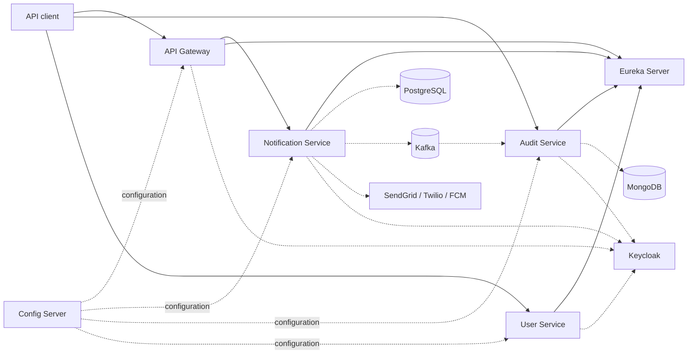
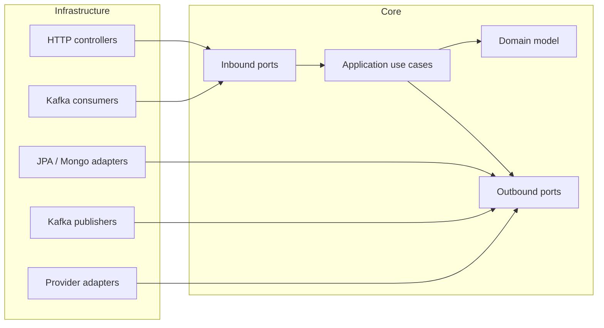
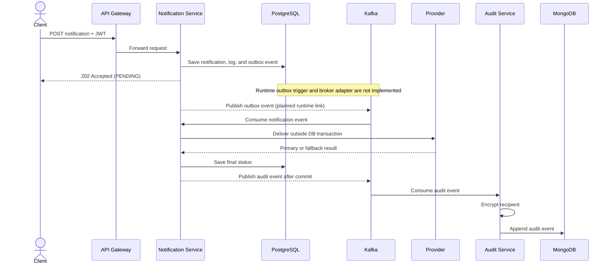
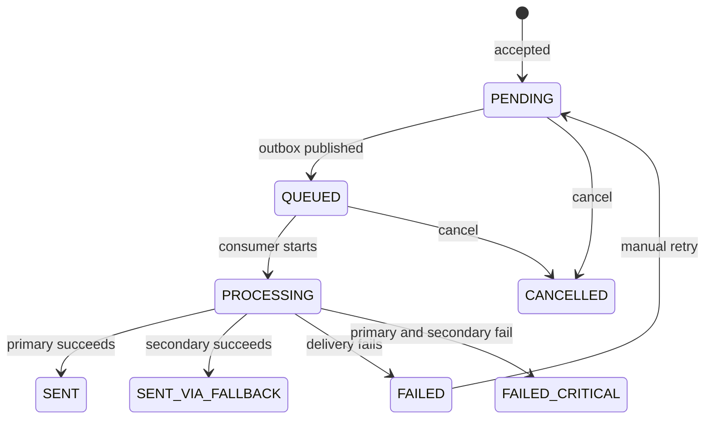

# Architecture

This document covers the internal design of AegisNotify: system topology, the notification
processing flow, the lifecycle state machine, the hexagonal layering, persistence, Kafka
interfaces, and resilience behavior. For a practical "how do I run and call this" overview, see
the [README](../README.md).

## System topology

The gateway, discovery server, and Config Server support three domain services. Dashed
connections below identify runtime dependencies that must be supplied outside this repository.



The gateway routes notification submission, status, and audit read requests, and enforces the
OAuth2 scope required for each route before proxying (`RouteScopeRules`). `GET /api/v1/audit/**`
is now proxied to `aegis-audit-service`, scope-gated on `audit:read`. The user endpoint is still
called directly, on port `8084` — `aegis-user-service` routes are defined in the gateway's scope
rule table but not yet proxied. The gateway also depends on Redis (`REDIS_HOST`/`REDIS_PORT`) to
back a per-JWT-subject token-bucket rate limiter on `POST /api/v1/notifications`; if Redis is
unreachable, the limiter degrades open (traffic is allowed through) rather than blocking
submissions, and the degradation is observable at `/actuator/health`. Config Server use is
optional, but its Git
backend and credentials must be supplied when enabled. Keycloak (`docker-compose.yml`) is the only
piece of infrastructure this repository starts for you; PostgreSQL, Kafka, and MongoDB are run
separately (see the [README](../README.md#installation)).

## Hexagonal layering

The notification, audit, and user services use Hexagonal Architecture. Dependencies point inward;
infrastructure implements application ports rather than leaking framework concerns into the core.



| Boundary | Responsibility |
| --- | --- |
| `domain/` | Pure entities, value objects, enums, state transitions, and domain exceptions |
| `application/` | Inbound use-case ports, outbound dependency ports, DTOs, and orchestration services |
| `infrastructure/` | HTTP and Kafka inbound adapters; JPA, MongoDB, Kafka, encryption, provider, Spring configuration, and security adapters |

The domain does not import Spring or persistence frameworks. ArchUnit tests in all three domain
services enforce these boundaries.

The notification workflow uses short transactions around state changes and deliberately performs
blocking provider HTTP calls outside a database transaction, avoiding long-held connections and
row locks.

## Notification processing flow

The intended flow is asynchronous so the HTTP request does not wait for an external provider:



1. `POST /api/v1/notifications` validates the request and recipient format.
2. The notification service verifies that the requested template exists and is active.
3. A notification, its initial log entry, and an outbox event are stored in one PostgreSQL
   transaction. The API returns `202 Accepted` with the notification ID and `PENDING` status.
4. `PublishOutboxEventService` maps `HIGH`, `MEDIUM`, and `LOW` priority events to separate Kafka
   topics, marks the outbox event processed, and advances the notification to `QUEUED`.
5. When enabled, `KafkaNotificationConsumer` consumes the priority topics with manual
   acknowledgment and delegates processing to the application layer.
6. The template is rendered, the notification becomes `PROCESSING`, and the channel provider is
   called outside the database transaction.
7. The final provider result is persisted as `SENT`, `SENT_VIA_FALLBACK`, `FAILED`, or
   `FAILED_CRITICAL`.
8. Lifecycle audit events are published to `notification-audit-events` after the surrounding
   database transaction commits. The audit service encrypts the recipient and atomically appends
   each event to a MongoDB audit-trail document.

Steps 4 through 7 describe implemented application and consumer behavior, but the repository
does not yet contain the runtime outbox trigger or the concrete outbound broker/DLT adapters
needed to connect the entire path.

## Notification lifecycle



Cancellation, manual retry, and manual DLT application use cases exist in source code, but they
are not exposed by the current HTTP controller. `CANCELLED` is present in the domain model; the
initial notification-table Flyway constraint does not yet include it, so cancellation persistence
requires further migration work.

> [!NOTE]
> The diagram shows domain-supported transitions. The current HTTP surface supports submission
> and status queries, not cancellation, retry, or manual DLT operations.

## Kafka interfaces

### Notification topics

| Purpose | Default topic |
| --- | --- |
| High-priority notifications | `high-priority-topic` |
| Medium-priority notifications | `medium-priority-topic` |
| Low-priority notifications | `low-priority-topic` |
| Dead letters | Source topic plus `-dlt`, for example `high-priority-topic-dlt` |

The configured topology uses three partitions, replication factor 3, and
`min.insync.replicas=2`. Activate the `local` Spring profile for the notification service when
using a single local broker; `application-local.yml` changes replication factor and minimum
in-sync replicas to 1.

The notification listener is disabled by default. Enable it with:

```bash
export NOTIFICATION_KAFKA_CONSUMER_ENABLED=true
```

The consumer uses manual acknowledgment, `auto.offset.reset=earliest`, two retries with a
one-second fixed backoff, and then publishes to the corresponding `-dlt` topic. Micrometer
counters record successful deliveries, failures, retries, and DLT publication by source topic.

`NOTIFICATION_KAFKA_RELAY_ENABLED` exists in configuration, but no runtime component currently
uses it to schedule or invoke the outbox publisher. Also note that `PublishOutboxEventService`
currently maps priorities to the three default topic names directly rather than reading renamed
topic values from configuration.

### Audit topic

The notification service publishes audit events to `notification-audit-events`, keyed by
notification ID to preserve per-notification ordering. Publication is deferred until after a
database transaction commits and is fire-and-forget; publishing can be disabled with
`audit.publishing.enabled=false`, which activates a logging fallback.

The audit service consumes with manual acknowledgment and retries failed records with a fixed
one-second backoff before Spring Kafka's dead-letter recoverer handles them. The audit consumer
starts whenever the audit service starts.

## Persistence

### PostgreSQL

Flyway migrations in
[`aegis-notification-service/src/main/resources/db/migration`](../aegis-notification-service/src/main/resources/db/migration/)
create:

- `templates` for channel-specific subject/body templates and variable declarations
- `notifications` for current notification state and provider outcome
- `outbox_events` for transactional message publication
- `notification_logs` for the notification service's local lifecycle history

JPA validates the schema at startup (`ddl-auto: validate`); Flyway owns schema changes.

### MongoDB

The audit service stores one document per notification ID. Each consumed event is encrypted and
atomically appended to the document's `events` array while `currentStatus` and `updatedAt` are
updated. Search supports status, channel, and creation-time filters.

Recipient values are encrypted with AES-GCM before persistence. Production startup requires
`AUDIT_ENCRYPTION_KEY`; the `local` profile provides a development-only fallback key.

## Resilience and delivery providers

The provider adapters call:

- SendGrid Mail Send API for `EMAIL`
- Twilio Messages API for `SMS`
- Twilio Messages API with `whatsapp:` addressing for `WHATSAPP`
- Firebase Cloud Messaging HTTP v1 API for `PUSH`

Each provider request has a five-second timeout and maps vendor or transport failures to a failed
provider result.

### Circuit breakers and provider failover

`ResilientNotificationProviderAdapter` is the implemented `NotificationProviderPort` adapter. It
wraps primary providers with one Resilience4j circuit breaker per channel and attempts an optional
secondary account when the primary call fails or its circuit is open. Secondary success produces
`SENT_VIA_FALLBACK`; failure of both attempts produces `FAILED_CRITICAL` for DLT handling.

Focused unit tests cover primary success, fallback success, dual failure, circuit opening, and
half-open recovery. This is still **not a production guarantee**: no end-to-end provider
environment, load behavior, operational thresholds, or production failover has been validated by
this documentation change. Secondary accounts are optional, while every primary provider
credential is required at notification-service startup.

## Observability

The gateway, notification service, and audit service expose configured actuator endpoints under
`/actuator`. Prometheus scraping is available at `/actuator/prometheus` where enabled.

The notification service publishes these custom Micrometer counters with a `topic` tag:

- `notification.kafka.consumer.success`
- `notification.kafka.consumer.failure`
- `notification.kafka.consumer.retry`
- `notification.kafka.consumer.dlt`

Spring Boot renders the names in Prometheus format, for example
`notification_kafka_consumer_success_total`.

The Resilience4j configuration registers circuit-breaker health indicators for the four provider
channels. No Prometheus server, dashboards, alert rules, or distributed tracing collector are
included in the repository.

## Project structure

```text
AegisNotify/
├── aegis-api-gateway/           # Reactive routing, JWT validation, and per-route scope enforcement
├── aegis-audit-service/         # Kafka-to-MongoDB audit trail service
├── aegis-config-server/         # Git-backed Spring Cloud Config server
├── aegis-eureka-server/         # Service registry
├── aegis-notification-service/  # Notification domain, API, outbox, Kafka, and providers
├── aegis-user-service/          # User administration against the Keycloak Admin API
├── mvnw                          # Unix Maven wrapper
├── mvnw.cmd                      # Windows Maven wrapper
└── pom.xml                       # Parent build and six-module reactor
```
